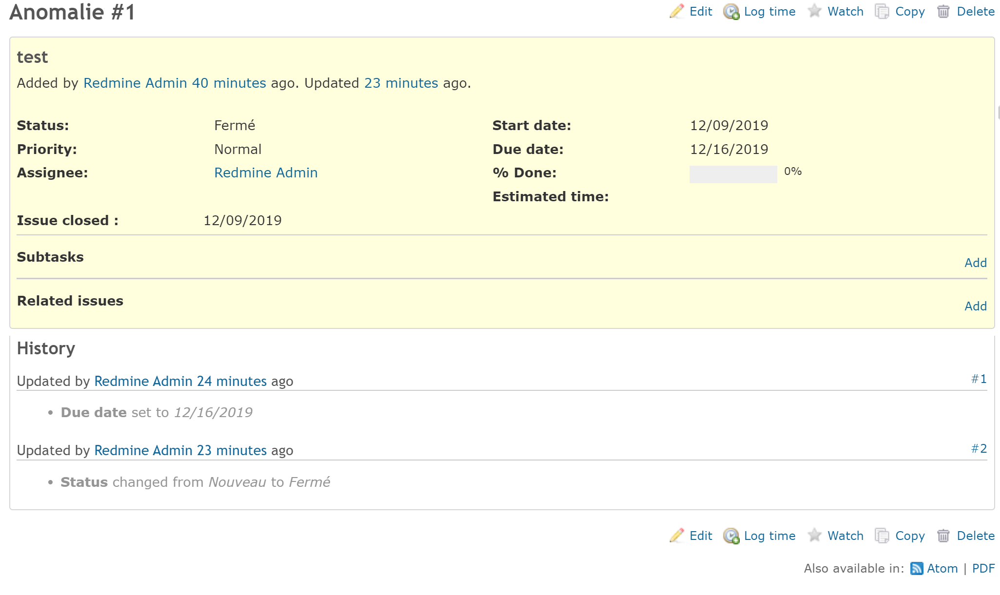

# Redmine Closed Date

## Summary

Add info closed_on on issue view




## Installation

```
$ cd redmine/plugins
$ git clone https://github.com/fraoustin/redmine_closed_date.git
```

restart Redmine
